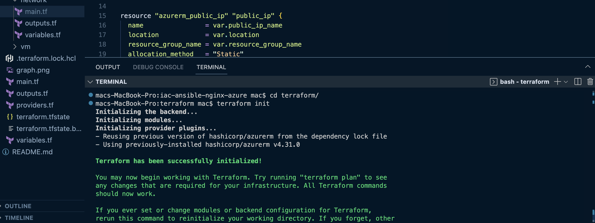

# Terraform-Ansible-Nginx-Azure

🚀 A fully automated project that provisions an Azure VM using Terraform, configures it with Ansible, and deploys a Dockerized Nginx web server with a custom HTML page.

---

## 🌐 Overview

This project demonstrates Infrastructure as Code (IaC) and Configuration Management using:
- **Terraform** for provisioning Azure infrastructure
- **Ansible** for software configuration and app deployment
- **Docker** to containerize and run an Nginx web server
- **Azure Virtual Machine** to host the application

---

## 📁 Project Structure

IAC-ANSIBLE-NGINX-AZURE/
   - terraform/
      - main.tf
         - provider.tf
         - output.tf
         - modules/
            - network/
              - main.tf               
              - variables.tf
              - outputs.tf      
            - vm/
              - main.tf
              - variables.tf
              - outputs.tf
             
   ansible/                            # Ansible playbooks and roles
      - inventory.ini                  # Ansible inventory with target hosts
        - deploy.yml                   # Main playbook to deploy Nginx Docker container
        - roles/nginx_docker/          # Custom Ansible role
          - tasks/
            - main.yml                 # Tasks to install Docker and run Nginx
          - files/             
            - Dockerfile               # Custom Dockerfile for Nginx
            - index.html               # Web content served by Nginx

---

## ⚙️ Technologies Used

- [Terraform](https://www.terraform.io/)
- [Microsoft Azure](https://azure.microsoft.com/)
- [Ansible](https://www.ansible.com/)
- [Docker](https://www.docker.com/)
- [Nginx](https://www.nginx.com/)

---

## 🛠️ How It Works

1. **Terraform** provisions:
   - Resource Group
   - Virtual Network & Subnet
   - Public IP & NIC
   - NSG with ports 22 and 80 open
   - Linux VM with SSH access

2. **Ansible** connects to the VM and:
   - Installs Docker
   - Copies `Dockerfile` and `index.html`
   - Builds a custom Docker image
   - Runs Nginx container exposing port 80

3. **Web app** is live and accessible via the VM's public IP.

---

## 🚀 Getting Started

### 🔧 Prerequisites
   - Azure CLI
   - Terraform
   - Ansible
   - SSH key pair (`id_rsa` and `id_rsa.pub`)

### 🧱 Deploy Infrastructure

   bash

   cd terraform

   terraform init
   
   

   terraform apply

   

🔐 Get Public IP
   
   bash
   
   Copy the terraform output public_ip add to the ansible inventory.ini file

   verify the created resources in azure.

   

### ⚙️ Configure & Deploy the app to azure vm with Ansible

   bash

   cd ../ansible

   ansible-playbook -i inventory.ini deploy.yml

   

   

### 🌍 Access Web App

Visit:
Copy

http://<your_public_ip>

Web app running in browser

### 🧠 Lessons Learned
   Modular Terraform structure improves reusability

   Ansible roles make configuration clean and reusable

   Dockerized apps simplify deployment on cloud VMs

### 🤝 Contributions
   Pull requests are welcome. Feel free to open issues for feature requests or bugs.